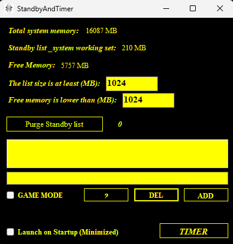

# StandbyAndTimer

A professional Windows optimization tool developed as a **University Project** to enhance system performance, reduce input latency, and manage memory efficiently.

## 🚀 Key Features

* **0.5ms Timer Resolution:** Locks the system timer to 0.5ms globally to minimize input lag and micro-stutters.
* **Intelligent RAM Purger:** Automatically monitors and clears the Windows Standby List based on user-defined memory limits.
* **Game Process Optimization:** Automatically sets "High Priority" and optimizes CPU Affinity for added games to ensure maximum performance during gameplay.
* **Auto-Start & Tray Support:** Can be configured to start with Windows and run quietly in the system tray.

## 🛠️ Installation & Usage

1.  Go to the **[Releases](https://github.com/Layellie/StandbyAndTimer/releases)** section and download the latest `.zip` file.
2.  Extract the files to a folder.
3.  Run `StandbyAndTimer.exe` as **Administrator** (Required for system-level timer and memory access).
4.  Configure your Standby RAM limits and add your game executables to the list.

## 💻 Technical Background

This application is built with **C#** and utilizes **Windows Native APIs** (`ntdll.dll`, `kernel32.dll`, `advapi32.dll`) to interact directly with the system kernel for high-precision timing and memory management.

## 🎓 Academic Project

This project was developed by **Samet Kaşmer (LAYE77IE)** for academic purposes to demonstrate system-level programming and optimization techniques in the Windows environment.

## 📜 License

This project is licensed under the MIT License - see the [LICENSE](LICENSE) file for details.

Note: Use at your own risk. While this tool uses standard Windows APIs, always ensure it complies with your specific game's terms of service.
